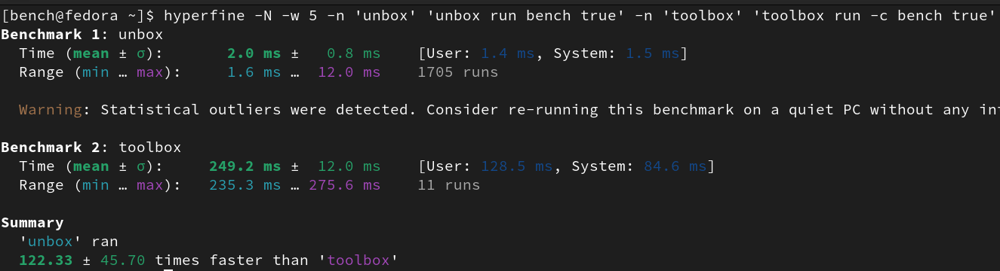
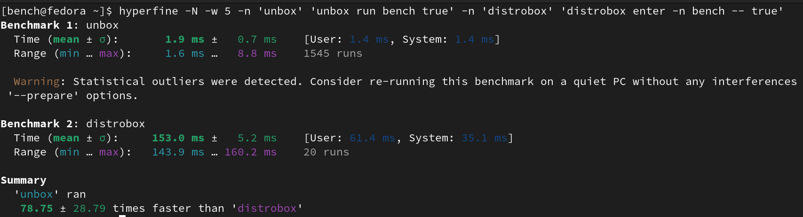

Performance of the time it takes to enter into a toolbox using `hyperfine`. The benchmark may give
a rough estimate of performance differences.

# Toolbx vs unbox

# Distrobox vs unbox

# Nsbox vs unbox

I was not able to get `nsbox` to work for this benchmark

# Devbox vs unbox

It could not be meaningfully compared because `devbox` does not have a `run` equivalent subcommand